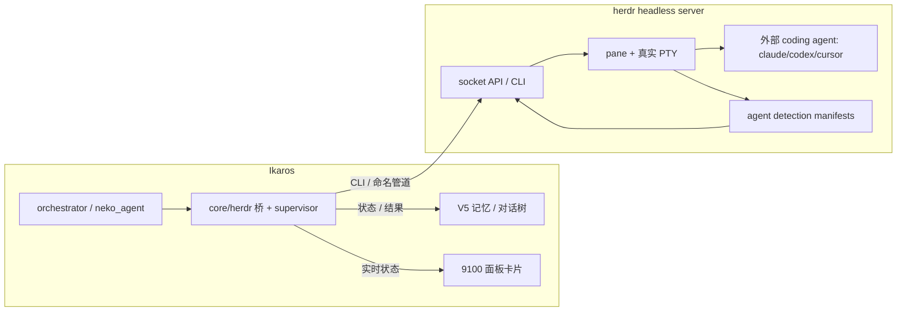

# herdr 集成设计文档（提案）

> 状态：提案 / 待评审 —— 尚未进入实现
> 范围：把 `herdr`（Rust coding-agent 终端多路复用器）作为受控组件接入 Ikaros
> 主要用途：**在受监控 pane 中运行外部 coding agent（claude / codex / cursor / aider …），由 Ikaros 协调、读取状态与输出**
> 参考源码：`E:\Ikaros-something\reference project\herdr-master\herdr-master`（ogulcancelik/herdr v0.7.5, Apache-2.0）

---

## 1. 背景与目标

Ikaros 当前没有终端多路复用 / PTY 能力。`core/neko/app/agent_server.py` 的自动化能力只覆盖 `browser_use` / `computer_use` / `OpenClaw`（桌面/浏览器自动化），无法在受监控的终端里跑、协调、并读取 coding agent 的实时状态。

`herdr` 正好补这块空白：它是一个 agent-aware 的终端多路复用器，把终端组织成 `workspace / tab / pane`，识别 pane 内运行的 coding agent，并暴露其 `idle / working / blocked / done / unknown` 生命周期状态。集成后，Ikaros 可以：

1. 在隔离的终端 pane 里启动外部 coding agent；
2. 通过语义状态（而非解析日志）判断 agent 在「工作中 / 等批准 / 已完成」；
3. 读取输出、等待状态变化、在 `blocked` 时把批准请求转给用户；
4. 把最终结果结构化回写到 V5 记忆 / 对话树。

**非目标（本次不覆盖）**：用户交互式终端 UI、Ikaros 自身 shell 执行的通用替代、源码级改造 herdr。这些可作为后续阶段。

---

## 2. herdr 架构摘要（已审阅）

| 维度 | 事实 |
|------|------|
| 形态 | Rust 单二进制；`herdr server` 起 headless 后台服务，客户端可 detach/reattach，进程过重启存活（`src/server/headless.rs` 最大模块，9859 行） |
| 状态模型 | `AppState` 纯数据（可无 PTY 单测），`PaneRuntime` 管真实终端；render 纯函数 |
| Agent 检测 | `src/detect/manifests/*.toml` 描述各 agent 屏幕特征，支持热重载（`server.reload_agent_manifests`） |
| 控制面 | 本地 socket API：Unix socket / **Windows 命名管道**，NDJSON；CLI `herdr` 是其封装，返回 JSON |
| 能力 | workspace/tab/pane/agent 全生命周期 + `events.subscribe` 事件订阅 + 插件系统（`herdr-plugin.toml`）+ Cloudflare Worker 插件市场 |
| PTY 依赖 | `portable-pty` + vendored `libghostty-vt`；**从源码构建需 Zig 0.15.2** |
| Agent 状态 | `idle`（可输入且已见）/ `working`（运行中）/ `blocked`（需批准/决策）/ `done`（跑完未见）/ `unknown`（无法判定） |
| 关键命令 | `herdr agent start <name> --kind <k> --pane <id>`；`herdr agent prompt <name> "…" --wait --timeout`；`herdr agent wait <name> --until blocked`；`herdr pane read <id> --source recent-unwrapped` |

**Agent 状态机（来自 SKILL.md）**：`agent.start` 阻塞到检测到目标 agent 就绪（默认 30s 超时）；`agent.prompt --wait` 等待首个稳定态（`idle`/`done`/`blocked`）；`agent.wait --until blocked` 等待批准态。这正对应 Ikaros 的监督循环。

---

## 3. Ikaros 现状与缺口

- 无 PTY / 终端多路复用组件；所有命令目前走裸 `subprocess` 或 neko 桌面自动化。
- 端口表里没有 herdr（herdr 不用 TCP 端口，用命名管道，与 `:8080/:9119/…` 不冲突）。
- 已有「受控组件 + 面板卡片」范式（`core/dashboard/server.py` 的 `COMPONENTS`，如 `neko_group`），可直接复用。
- 已有 Python↔外部进程桥接范式（`bin/hermes_paw_bridge.py`、`core/conversation-tree/server.py` 调 `v5s`）。
- 已有记忆/对话落库通路（`core/memory_v5/store.py`、`core/memory_v5/conversation_tree.py`）。

---

## 4. 集成架构总览



四层映射（与 Ikaros L0–L3 逻辑分层对齐）：

- **L0 运行时**：`runtime/herdr/herdr.exe` —— 受控二进制，注册 `IKAROS_HERDR`。
- **L1 桥接**：`core/herdr/` Python 包 —— 封装 CLI（首选）+ 命名管道 socket（事件订阅），暴露 `HerdrClient` 与 `CodingAgentSupervisor`。
- **L2 编排**：orchestrator / neko_agent 调用 supervisor，把 coding 任务下发给 herdr pane 里的外部 agent，监督其状态并回收结果。
- **L3 展示**：9100 面板卡片显示 herdr 服务状态 + 活跃 agent；可选 Neko 面板列出 workspace/agent 状态徽标。

---

## 5. 组件设计

### 5.1 L0 运行时（二进制托管）

- 放置：`runtime/herdr/herdr.exe`（Windows beta 二进制）。
- 环境变量：在 `core/env/ikaros-env.bat` + `.ps1` + `ikaros-paths.json` 注册 `IKAROS_HERDR=%IKAROS_ROOT%\runtime\herdr\herdr.exe`（遵循 `docs/ARCHITECTURE.md` §3.2 路径注册规则）。
- 获取方式：用现有 `bin/ikaros-fastdl.py`（gopeed → aria2c → urllib，mirror `hf-mirror.com` 同款）下载 GitHub Release 的 Windows 资产，落到 `runtime/herdr/`。**不**从源码构建（避免引入 Zig 工具链）。
- 探活：`herdr status` 或检查命名管道存在性（Windows：`\\.\pipe\herdr` 一类；具体路径由 `herdr server` 启动日志/`HERDR_SOCKET_PATH` 决定）。

### 5.2 9100 面板卡片

在 `core/dashboard/server.py` 的 `COMPONENTS` 增加一项（参考 `neko_group` 写法）：

```python
{"id": "herdr", "name": "Herdr 终端编排", "category": "Backend",
 "desc": "coding-agent 终端多路复用器 (headless server)",
 "ports": [], "markers": ["herdr"],   # 命名管道不占 TCP，用进程 marker 探测
 "panel_url": None}
```

- 启动：`herdr server`（headless 后台）。需在 Ikaros 的隐藏窗口范式下启动（参考面板用 `pythonw.exe` / `launch-hidden.vbs`）。
- 停止：`herdr server stop`（**注意 SKILL.md 警告：别从活跃会话里误停 server**）。
- `BOOT_PROFILE`：可选加入，默认不随全栈自启（coding agent 编排按需开启）。

### 5.3 L1 Python 桥 `core/herdr/`

文件：`core/herdr/client.py`、`core/herdr/supervisor.py`、`core/herdr/config.py`。

`HerdrClient`（CLI 优先，简单稳）：

```python
class HerdrClient:
    def __init__(self, socket_path: str | None = None): ...
    # workspace / tab
    def workspace_create(self, cwd, label=None) -> dict
    def workspace_list(self) -> list
    # pane
    def pane_split(self, pane_id, direction="right", cwd=None, env=None) -> dict
    def pane_run(self, pane_id, command) -> None          # 原子发送命令+回车
    def pane_read(self, pane_id, source="recent-unwrapped", lines=120) -> str
    def pane_wait_output(self, pane_id, match=None, regex=None, timeout=None) -> bool
    # agent
    def agent_start(self, name, kind, pane_id, timeout=30) -> dict
    def agent_prompt(self, name, text, wait=True, timeout=120) -> dict
    def agent_wait(self, name, until="done", timeout=120) -> dict
    def agent_get(self, name) -> dict
    def agent_read(self, name, source="recent-unwrapped", lines=120) -> str
    # 事件（可选，需命名管道长连接）
    def subscribe(self, subscriptions: list) -> Iterator[dict]
```

- **socket 路径解析**：遵守 herdr 顺序（CLI `--session` → `HERDR_SOCKET_PATH` → `HERDR_SESSION` → 默认）。Windows 上为命名管道，优先用 CLI 封装（CLI 自己处理平台原生路径），事件订阅再按需开命名管道长连接（Python 侧用 `win32pipe` / `msvcrt` 或第三方 `namedpipe` 包）。
- **协议稳健性**：调用前先 `ping` 校验 `protocol_version`，对未知字段宽松处理。

`CodingAgentSupervisor`（编排核心，L2 的 Python 实现落在这里）：

```python
class CodingAgentSupervisor:
    def run_task(self, task: str, kind: str, cwd: str,
                 pane_id=None, timeout_s=600, approval_cb=None) -> TaskResult:
        # 1. 取/建 pane（pane_split，保留 cwd）
        # 2. agent.start <kind>  （检测就绪）
        # 3. agent.prompt <task> --wait
        # 4. loop:
        #      state = agent.wait --until blocked|done
        #      if blocked: 调用 approval_cb(agent_read) 拿用户决策 -> agent.send_keys
        #      if done:   break
        # 5. 回收 agent_read 完整输出 -> TaskResult(output, state, meta)
```

### 5.4 L2 编排接入

两个调用方：

1. **orchestrator / agent loop**：当 Ikaros 判断「这是一个需要在仓库里实际执行的 coding 任务」时，调用 `CodingAgentSupervisor.run_task(...)`，拿回结果塞进回复或记忆。
2. **对话树 `/api/chat` 增强**：在 `core/conversation-tree/server.py` 的 `_call_llm()` 之外，新增「执行类」分支——若消息意图是「改代码 / 跑测试 / 建分支」，转交 herdr supervisor，结果作为节点结论回写（复用现有 `conclude_branch` / `merge_branch` 通路）。

**状态映射**（herdr → Ikaros 内部事件）：

| herdr agent 状态 | Ikaros 处理 |
|------------------|-------------|
| `working` | 面板状态=运行中；可阶段性 `pane_read` 摘要进 V5 流式记忆 |
| `blocked` | 触发 `approval_cb` → 经 Neko/面板弹出批准请求；未确认前不继续 |
| `done` | 回收输出 → 落 V5 记忆 / 对话树节点；面板状态=完成 |
| `idle` | 视为可接管；等待用户或下一个任务 |
| `unknown` | 标灰，提示「无法判定」，不自动当作完成 |

### 5.5 L3 展示

- 9100 面板卡片：显示 herdr 服务 UP/DOWN + 活跃 agent 数 + 各 agent 状态徽标。
- 可选 Neko 前端面板：列出 workspace/tab/pane 树与外部 agent 状态（复用 herdr `session.snapshot` + `agent.list`）。

---

## 6. 数据流（一个 coding 任务）

```
用户/编排器发起 coding 任务
  -> CodingAgentSupervisor.run_task(task, kind, cwd)
    -> herdr workspace/tab/pane 建立隔离终端
    -> herdr agent start <kind>          （检测外部 agent 就绪）
    -> herdr agent prompt <task> --wait
    -> [working] 阶段性 pane_read -> V5 流式记忆（可选）
    -> [blocked] approval_cb -> 用户批准 -> agent.send_keys 继续
    -> [done]    回收 agent_read 完整输出
  -> TaskResult 回写 V5 记忆 / 对话树节点结论
  -> 面板状态更新为「完成」
```

---

## 7. 关键风险与对策

| 风险 | 对策 |
|------|------|
| 语言边界 Rust↔Python | 只用 CLI / 命名管道通信，绝不嵌入或调用 Rust 内部；桥接层是唯一点。 |
| Windows 命名管道事件订阅复杂 | 第一版以 CLI（stdout JSON）为主；事件订阅作为第二阶段，需要时用原生命名管道客户端。 |
| 源码构建需 Zig 0.15.2 | 采用发布二进制 + gopeed 下载，不引入构建链。后续若要定制 manifest 仍可下载二进制 + 本地 override。 |
| `herdr server` 在 Windows 后台 headless 是否稳 | 实施 Phase 0 先验证 `herdr server` + `herdr status` 在 Windows 下可后台常驻；失败则改用 `herdr`（前台 attach 进程）改守护方式。 |
| 端口/资源冲突 | herdr 用命名管道，不占 TCP；与 Ikaros 端口表无冲突。 |
| 外部 agent 执行任意命令的安全边界 | supervisor 只启动**用户显式指定的 kind**；`blocked` 必须人工确认后才继续；不自动 `agent.send_keys` 绕过批准。 |
| 协议演进 | 每次调用前 `ping` 校验 `protocol_version`；对未知字段 `serde_ignored` 风格宽容。 |
| herdr 非 Ikaros 受控依赖 | 二进制走 `runtime/herdr/`，下载有 checksum 校验（`herdr` 自带签名/哈希），与 `ikaros-fastdl.py` 一致。 |

---

## 8. 文件变更清单

| 文件 | 变更 |
|------|------|
| `runtime/herdr/herdr.exe` | 新增（下载的 Windows 二进制） |
| `core/env/ikaros-env.bat` / `.ps1` | 注册 `IKAROS_HERDR` |
| `ikaros-paths.json` | 新增 `herdr` 条目 |
| `core/dashboard/server.py` | `COMPONENTS` 增加 `herdr`；启停逻辑 |
| `core/herdr/__init__.py` | 新包 |
| `core/herdr/client.py` | `HerdrClient`（CLI/socket 封装） |
| `core/herdr/supervisor.py` | `CodingAgentSupervisor`（编排 + 状态机） |
| `core/herdr/config.py` | socket 路径解析 + 默认 kind 列表 |
| `core/memory_v5/orchestrator.py` 或 `core/neko/app/agent_server.py` | 接入 supervisor（调用点） |
| `core/conversation-tree/server.py` | `/api/chat` 增加「执行类」分支（可选） |
| `core/dashboard/index.html` / `panel.html` | herdr 卡片 UI |
| `docs/ARCHITECTURE.md` | 端口/组件表增加 herdr（提交时同步，遵循 doc-drift 规则） |

---

## 9. 实施里程碑（分阶段，每阶段可独立验证）

- **Phase 0 — 可行性验证（1–2h）**：下载 Windows 二进制到 `runtime/herdr/`；验证 `herdr server` 后台常驻 + `herdr status` + `herdr agent`/`pane` 基础命令在 Ikaros 环境可用；确认命名管道路径。
- **Phase 1 — L0 + 面板卡片（2–3h）**：注册环境变量；`COMPONENTS` 加 `herdr`；启停与探活跑通；面板卡片显示 UP/DOWN。
- **Phase 2 — L1 桥 + supervisor（4–6h）**：`HerdrClient` 封装 CLI；`CodingAgentSupervisor` 实现 start→prompt→wait→read→回收；单测用 `herdr` 自带 test session 隔离。
- **Phase 3 — L2 编排接入（3–5h）**：orchestrator / neko_agent 调用点；`blocked`→用户批准回路；结果回写 V5 记忆 / 对话树。
- **Phase 4 — L3 展示 + 打磨（2–3h）**：面板 agent 状态徽标；可选 Neko 面板；文档同步 `ARCHITECTURE.md`。

每阶段验收：Phase 0 跑通 `herdr agent start/ prompt/ wait/ read` 一条真实外部 agent（如 `aider` 或 `claude`）闭环；Phase 1 面板启停 herdr；Phase 2 supervisor 单测绿；Phase 3 一个 coding 任务经 Ikaros 发起并结果落库；Phase 4 UI 状态正确。

---

## 10. 开放问题（待确认）

1. **支持的外部 agent kind 列表**：先支持哪几个？（建议 `aider` / `claude` / `codex`；需确认这些 binary 在 Ikaros 环境可用 / 有 API key。）
2. **批准 UX 落点**：`blocked` 时弹窗放在 9100 面板还是 Neko 前端？还是先仅日志 + 手动 `herdr agent send-keys`？
3. **是否后续 vendoring**：本次用二进制；若需自定义 detection manifest 或 Ikaros 专属 agent 类型，再评估 fork 源码（需补 Zig）。
4. **cwd / 仓库边界**：supervisor 默认在哪个仓库目录起 pane？是否限制只能在某几个白名单目录？

---

## 11. 可借鉴的通信模式（Socket API）—— 超越二进制集成

> 用户洞察（2026-07-28）：herdr 最值得学的是它的 **Socket API 通信设计**——agent 之间经 socket 通信、状态广播、detach/reattach。即使不集成 herdr 二进制，这套「通信架构」也可用于 Ikaros 自身的**多子任务并发**与 **conversation-tree 实时进度展示**。

### 11.1 三个可迁移的支柱

1. **Server = 唯一真相，Client 无状态**：herdr server 拥有 pane/进程状态；客户端 detach 后重连，先 `session.snapshot` 引导本地缓存，再 `events.subscribe` 增量更新。→ Ikaros 的多子任务运行时也应由一个常驻 server 持有 branch/subtask 状态，UI 是纯订阅方，不各自持有真相。
2. **语义状态广播，而非日志轮询**：`events.subscribe` 推送 `pane.agent_status_changed` 等**类型化事件**；agent 状态是 `idle/working/blocked/done` 语义值，不是解析 stdout。→ conversation-tree 每个节点应有语义执行状态，UI 订阅事件流做实时进度，而不是定时 `GET /api/state` 轮询。
3. **Detach/reattach：任务存活于 UI 之外**：客户端断开 / 面板重启，后台 agent 继续跑；重连即恢复。→ Ikaros 的子任务应由独立 supervisor 进程执行，不受 Neko 面板 / 9100 面板开关影响；用户关掉前端，任务照跑，重开即见进度。

### 11.2 概念映射（herdr → Ikaros）

| herdr | Ikaros conversation-tree 借鉴 |
|-------|-------------------------------|
| pane（真实终端单元）| node / branch（一个工作单元）|
| agent 生命周期状态 | 节点执行状态 badge（`working`/`blocked`/`done`）|
| `events.subscribe` + 类型化事件 | 任务事件流（WebSocket / SSE / 本地 socket）|
| `session.snapshot` 引导 | `GET /api/state` 全树快照引导 |
| workspace / tab | 一次「任务批次」/ 一个对话会话 |
| 协议版本 `PROTOCOL_VERSION` | Ikaros 内部事件协议也需版本化，向前兼容 |

### 11.3 对 conversation-tree 的具体启示

- 现有 `core/conversation-tree/server.py` 是 REST（`ThreadingHTTPServer`）+ 前端轮询式刷新。可加一层**事件流端点**（WebSocket / SSE / 本地命名管道），节点状态变更即推。
- 节点数据模型已支持 `node_type` / `is_valid` / `conclusions` / `skills_used` / `tool_calls`；再加一个 `exec_state`（`pending`/`working`/`blocked`/`done`）即可直接渲染进度徽标。
- 多子任务并发：一个「任务批次」下分多个 branch，各自经 supervisor 跑，进度经事件流实时汇入同一棵树——天然复用 fork/merge 拓扑。
- 断线重连：前端启动先 `GET /api/state` 拿全树快照，再订阅事件；与 herdr 的 `snapshot + subscribe` 一一对应。

### 11.4 收益

- 不耦合 herdr 二进制也能获得「实时多任务进度」能力；
- 为后续真正集成 herdr（§5）提供统一的事件/状态契约，二者可共用同一套 `exec_state` 语义；
- 9100 面板、Neko 前端、外部工具都能订阅同一个任务事件总线。

---

## 12. 确认路线：Path B（二进制引擎 + 原生模型）

> 决策（2026-07-28）：用户确认「深度融入」走 **Path B**——herdr 发布二进制作终端/PTY/检测引擎，Ikaros 在之上**原生内化**其通信/状态/会话模型，深融进 conversation-tree。不源码 vendoring（避开 Zig 0.15.2 构建链），不纯重实现（避开自研 PTY/终端仿真/声明式检测）。

### 12.1 Path B 分层落地

1. **引擎层（herdr 二进制）**：下载发布二进制到 `runtime/herdr/herdr.exe`；注册 `IKAROS_HERDR`；headless server 提供真实 PTY + 终端仿真 + 声明式 agent 检测（含 `hermes.toml`，Ikaros 自身 Hermes agent 已被识别）。
2. **传输层（✅ 已落地）**：`core/herdr/client.py` 深度 socket 客户端——直接说 herdr NDJSON 协议，请求/响应 id 关联 + 长连接 `events.subscribe` 事件分发。已用 mock server 自测通过（无真实二进制依赖）。
3. **模型层（Ikaros 原生）**：把 herdr 的「server=唯一真相 + 客户端订阅 + 语义状态 + 断线重连」内化：
   - Ikaros 任务事件总线（复用 herdr `events.subscribe` 语义，类型化事件）；
   - conversation-tree 节点 `exec_state`（`pending`/`working`/`blocked`/`done`）+ 实时进度 badge；
   - 断线重连：`GET /api/state` 快照 + 订阅（对应 herdr `session.snapshot` + `events.subscribe`）；
   - herdr 命名 session ↔ Ikaros conversation session / 任务批次对齐。
4. **编排层**：`CodingAgentSupervisor`（`core/herdr/supervisor.py`）调客户端跑外部 coding agent，状态回写 `exec_state` 并落 V5 记忆 / 对话树。
5. **展示层**：9100 面板 herdr 卡片 + Neko 前端 agent 状态/进度。

### 12.2 修订后里程碑（B 向）

- **B0 — 引擎就位 ✅（2026-07-28 晚）**：Windows 二进制已落地（preview-2026-07-21，稳定版无 Windows 构建）；`herdr server` headless 常驻验证通过；注册 `IKAROS_HERDR`；命名管道路径确认。详见 §12.4。
- **B1 — 深度客户端 ✅（2026-07-28 晚）**：`core/herdr/client.py` 已接真实 Windows 命名管道并端到端验证（ping/workspace/pane/agent 全跑通）。详见 §12.4。
- **B2 — Ikaros 事件总线 + conversation-tree ✅（2026-07-28 晚）**：`core/taskbus.py` 任务事件总线；conversation-tree 加 **SSE** 事件流端点 `GET /api/events` + 节点 `exec_state`(idle/pending/working/blocked/done/unknown) + 实时进度徽标；前端 `EventSource` 订阅替代轮询。详见 §12.5。
- **B3 — 会话对齐 ✅（2026-07-29）**：`core/herdr/session.py` — `SessionRegistry`（herdr 会话↔Ikaros 对话会话↔任务批次 持久化映射）+ `SessionBridge`（真实 `session.snapshot` 引导 + `events.subscribe([])` 增量同步，agent 状态归一为节点 `exec_state`）。结构已对真实 server 校验（快照包 `snapshot` 包裹、panes 扁平列表、状态字段 `agent_status`、订阅 `[]`=全部）。详见 §12.6。
- **B4 — supervisor 编排 ✅（2026-07-29）**：`core/herdr/supervisor.py` — `CodingAgentSupervisor` 状态机（bind→workspace.create→bind_workspace→bridge.attach→agent.start→agent.prompt --wait[blocked,done]→blocked: approval_cb/NeedsApproval→approve→done→pane.read 回写）；驱动节点 `exec_state` 全链路；`blocked` 必须人工确认后才继续。详见 §12.7。
- **B5 — 展示打磨 ✅（2026-07-29）**：9100 面板 herdr 卡片（读节点 `exec_state`/`exec_detail` 徽标 + `blocked` 弹批准框）+ `:48920` supervisor 端点（`/api/supervisor/run`、`/api/supervisor/approve`）；`docs/ARCHITECTURE.md` 同步。详见 §12.8。

### 12.3 本回合已完成

- 创建 `core/herdr/__init__.py` + `core/herdr/client.py`：深度 socket 客户端（NDJSON、id 关联、事件订阅分发、Windows 命名管道传输、`ping` 与便捷方法）。
- `core/herdr/_selftest.py`：mock NDJSON server 自测，PASS（请求/响应关联、事件分发、pane.read 均通过，无外部依赖）。
- **B0 真实落地**：下载 preview Windows 二进制到 `runtime/herdr/herdr.exe`（19.98 MB），`herdr server` headless 验证通过（protocol 17），注册 `IKAROS_HERDR`（paths.json + .bat + .ps1），修 `fastdl.json` 的失效 `gh` 镜像（ghproxy.com → ghproxy.net）。
- **B1 真实端到端验证**：`client.py` 接真实命名管道跑通 `ping / workspace.create / workspace.focus / pane.run / pane.read / pane.split / agent.start / agent.prompt / agent.wait`，字段形全部对齐真实协议。
- **B2 任务事件总线 + conversation-tree 事件流 ✅**：
  - 新建 `core/taskbus.py`：线程安全 `EventBus`（`subscribe`→退订函数 / `publish` 广播；handler 异常隔离）+ 版本化 `TaskEvent`（`v/type/ts/tree/data`）+ `exec_state_event()` 便捷构造器。零第三方依赖。
  - `core/memory_v5/conversation_tree.py`：`ConvNode` 加 `exec_state / exec_progress / exec_detail`（`to_dict/from_dict` 兼容 v1/v2）；`ConversationTree` 加 `event_bus` 属性 + `set_exec_state()`（状态跳变时持久化、progress-only 不落盘、始终发布 `node.exec_state_changed` 事件）。
  - `core/conversation-tree/server.py`：全局共享 `EventBus` 注入到树；`GET /api/events` **SSE 端点**（hello 帧 + 实时事件 + 15s 心跳，断线退订）；`POST /api/node/exec_state` 经 `set_exec_state` 驱动事件流。Handler 升级 `HTTP/1.1` 以支持长连接。
  - `core/conversation-tree/index.html`：启动时 `EventSource('/api/events')` 订阅，实时更新节点徽标（不再轮询）；卡片渲染 `exec_state` 徽标（pending/working/blocked/done + 颜色/脉冲动画）+ 进度条 + 细节说明；新增 `API.setExecState()`。
  - 单测：`tests/test_taskbus.py`（4 例）+ `test_conversation_tree.py` 扩 `TestExecState`（4 例）+ V2 默认/序列化断言；**共 41 passed**。
  - 端到端验证：48920 重启后 `POST /api/node/exec_state` → SSE 实时收到 `node.exec_state_changed`（含 prev_state）→ 状态落盘 → 前端徽标更新。

### 12.4 B0 / B1 实战落地记录（2026-07-28 晚）

#### 二进制与引擎层
- **稳定版（v0.7.5/v0.7.4/v0.7.3）均无 Windows 二进制**；只有 **preview 预览版** 带 `herdr-windows-x86_64.exe`。已选最新 preview `preview-2026-07-21-0f10e1453a7f`（与 v0.7.5 同日、协议同源）。
- 下载经 `ghproxy.net` 镜像（项目 `fastdl.json` 原 `ghproxy.com` 已失效，已改）。落点 `runtime/herdr/herdr.exe`，`PE32+ console x86-64`，`herdr 0.7.5-preview.2026-07-21`。
- `herdr server` 在 Windows 后台常驻验证通过：`herdr status` → `status: running, protocol: 17, compatible: yes`。
- 真实 socket 路径：`C:\Users\PZS0X\AppData\Roaming\herdr\herdr.sock`（Windows 上实为命名管道）。`herdr.sock` 文件只是哨兵（`pid:random`），真实 IPC 是命名管道。

#### 命名管道名（B1 关键）
- interprocess `GenericNamespaced` 在 Windows 上把 socket 文件**完整路径原样**拼到 `\\.\pipe\` 后：
  `\\.\pipe\C:\Users\PZS0X\AppData\Roaming\herdr\herdr.sock`
- 经 `FindFirstFileW("\\.\pipe\*")` 枚举确认；`\\.\pipe\herdr.sock`（仅文件名）是错误的。
- `client.py` 的 `_ns_pipe_name` 已改为 `\\.\pipe\` + 完整路径；优先 `win32file`，缺失时 `ctypes` 兜底（portable-python 已带 pywin32）。

#### 真实协议坑（B2/B4 必读）
1. **连接模型**：普通 RPC「开连→发→读→关」（服务器响应后即关闭连接）；`events.subscribe` 才长连。客户端已改为「每请求独立连接」。
2. **无 `protocol_version` 方法**：协议号取 `ping` / `session.snapshot` 的 `protocol` 字段（当前 17）。
3. **`pane.read`**：`source` 枚举在原始 API 用**下划线** `recent_unwrapped`（文档/CLI 用连字符 `recent-unwrapped`，会报 unknown variant）；输出在 `result.read.text`（非 `result.text`）。
4. **`pane.run`** → `pane.send_text`，文本末尾用 **`\r\n`** 触发执行（PowerShell pane 实测）；`pane.send_keys` 的 `keys` 是**数组**（如 `["enter"]`）。
5. **`pane.split` 必须先 `workspace.focus(wid)`**：herdr split 作用于**当前 focused pane**。实测传 `pane_id=w5:p1` 却切了全局 focused 的 `w2:p1`；先 `workspace.focus(w5)` 再 `pane.split(w5:p1)` 才正确返回 `w5:p2`。supervisor 流程：create → `workspace.focus` → split。
6. **agent 字段形**：
   - `agent.start`：`{name, kind, pane_id}`（注册 agent，重名报错；无 agent 二进制也不立即报错）。
   - `agent.prompt`：用 **`target`**（pane_id）而非 `name`；`wait.until` 是**状态数组**（如 `["idle"]`）。
   - `agent.wait`：用 **`target`**（pane_id）；`until` 是**数组**（如 `["done"]`）。
7. **`session.snapshot` / `workspace.list` 在无前台 TUI 客户端时返回空**——不能直接回查。supervisor 必须 **用 create/start 响应里返回的 id**（如 `root_pane.pane_id`），不要依赖 list/snapshot 枚举。

#### 状态
- B0 ✅ 引擎就位；B1 ✅ 传输层真实跑通；B2 ✅ 任务事件总线 + conversation-tree 事件流就位；**B3 ✅ 会话对齐就位**；**B4 ✅ supervisor 编排就位**；**B5 ✅ 展示打磨就位**（9100 面板 herdr 卡片 + `:48920` supervisor 端点 + docs 同步）。Path B 全链路贯通。

---

### 12.5 B2 实战落地记录（2026-07-28 晚）

#### 交付物
| 文件 | 作用 |
|------|------|
| `core/taskbus.py` | 进程内类型化事件总线（herdr `events.subscribe` 语义内化）。`EventBus.subscribe(handler)`→返回退订函数；`EventBus.publish(event)` 广播；`TaskEvent` 带协议版本 `v`。 |
| `core/memory_v5/conversation_tree.py` | `ConvNode.exec_state/exec_progress/exec_detail`；`ConversationTree.event_bus` + `set_exec_state()`。 |
| `core/conversation-tree/server.py` | 共享 `EventBus` 注入树；`GET /api/events`（SSE）；`POST /api/node/exec_state`。 |
| `core/conversation-tree/index.html` | `EventSource` 订阅 + 节点徽标/进度条渲染 + `API.setExecState()`。 |
| `tests/test_taskbus.py` | 总线单测（4 例）。 |
| `core/memory_v5/tests/test_conversation_tree.py` | `TestExecState`（4 例）+ V2 序列化断言。 |

#### SSE 协议（对应 herdr `events.subscribe`）
```
GET /api/events   (text/event-stream, HTTP/1.1, 15s 心跳)
→ 首帧:  event: hello
         data: {"v":1,"type":"hello","ts":<epoch>,"tree":"ui_conversation_tree","data":{"event_protocol":1}}
→ 每事件: data: {"v":1,"type":"node.exec_state_changed","ts":<epoch>,"tree":"ui_conversation_tree",
                 "data":{"node_id":"n_xxx","exec_state":"working","progress":0.3,"detail":"...","prev_state":"idle"}}
```
- 客户端先 `GET /api/state` 拿全树快照引导（对应 herdr `session.snapshot`），再订阅增量（对应 `events.subscribe`）——与 §11.2 映射一致。
- 断线重连：浏览器 `EventSource` 自动重连；重连后应先拉 `/api/state` 再继续。

#### set_exec_state 语义
- `state ∈ {idle, pending, working, blocked, done, unknown}`（未知值归 `unknown`，容错）。
- **状态跳变**（state 值改变）→ 持久化（落盘拓扑 JSON）。
- **progress-only 更新**（同 state 仅改进度）→ **不落盘**（避免高频 tick 写盘），但仍发布事件；可由 `persist_on_progress=True` 强制。
- 始终发布 `node.exec_state_changed` 事件（若 `tree.event_bus` 已注入）。

#### 给 B3/B4 的契约
- supervisor（B4）调 `tree.set_exec_state(node_id, "working"/"blocked"/"done", progress=..., detail=...)` 即驱动全部订阅方（前端徽标、9100 面板、外部工具）实时更新——无需各自轮询。
- herdr session ↔ Ikaros conversation session / 任务批次（B3）对齐时，可让同一 `EventBus` 实例跨会话共享，或直接订阅该端点。
- 9100 面板卡片（B5）只需 `new EventSource('http://127.0.0.1:48920/api/events')` 即可拿到全部节点状态流。

#### 已知限制
- SSE 端点用 `HTTP/1.1` keep-alive；目前未做订阅方鉴权/过滤（全树事件广播，未来可按 `tree` 字段过滤多会话）。
- 进度(progress) 默认不持久化，重连后进度回退到最近一次状态跳变值（progress 为短暂过程量，符合预期）。

---

### 12.6 B3 实战落地记录（2026-07-29）

#### 交付物
| 文件 | 作用 |
|------|------|
| `core/herdr/session.py` | `SessionBinding`/`WorkspaceBinding` 数据模型；`SessionRegistry`（JSON 持久化、线程安全）做 **herdr 会话 ↔ Ikaros 对话会话(`persist_key`) ↔ 任务批次(`workspace_id`)** 三者映射与查询；`SessionBridge` 把 `HerdrClient` 接到 `ConversationTree`，先 `session.snapshot` 引导再 `events.subscribe` 增量同步，agent 状态归一为节点 `exec_state`。 |
| `core/herdr/__init__.py` | 导出 `SessionRegistry` / `SessionBridge` / `SessionBinding` / `WorkspaceBinding` / `map_agent_status`。 |
| `tests/test_herdr_session.py` | 6 例单测：状态归一、注册表绑定/查询/持久化/重载/优先级、bridge 快照→exec_state 映射、事件→exec_state 增量（mock client）。 |

#### 真实 server 校验（协议 17）修正的关键假设
- **快照包裹**：真实返回 `{"type":"session_snapshot","snapshot":{...}}`，数据在 `snapshot` 下，非顶层。
- **panes 为扁平列表**（每个自带 `workspace_id`），非嵌套在 tabs 下；`workspaces`/`tabs`/`panes`/`agents` 均顶层列出。
- **状态字段是 `agent_status`**（workspace/tab/pane 级），值 `idle/working/blocked/done/unknown`；`unknown` = 无有效 agent 信号，快照引导时跳过（不覆盖节点）。
- **订阅格式 `[]` = 订阅全部事件**（ack `{"type":"subscription_started"}`）；按资源订阅需 `{"type":"pane"}` 等 internally-tagged 变体（B4 再细化，bridge 目前订阅全部并用 `_on_event` 过滤）。

#### 给 B4 的契约
- supervisor 流程：`registry.bind_session(tree.persist_key, herdr_socket)` → 建 workspace 拿 `root_pane.pane_id` → `registry.bind_workspace(tree.persist_key, ws_id, node_id)` / `bind_pane(...)` → `SessionBridge(client, tree, registry).attach()` 即让该批次进度随 herdr agent 状态实时回流到对话树节点徽标。
- `bridge.resync()` 在 Ikaros 重启后调用即可"重连"——对应 herdr `session.snapshot` + `events.subscribe` 的 detach/reattach 模式。
- 事件 envelope 容错解析（`params.event`/`params.data` 或 `params.type`/`params.payload`）；真实 agent 状态变更事件形状将在 B4（实跑 agent）时最终确认，bridge 已 tolerant。

#### 已知限制
- **subscribe 长连接关闭在 Windows 同步管道读上不会立即中断阻塞读**——`client.close()` 在关闭订阅连接时可能挂起（监听器是 daemon 线程，随进程退出回收）。当前 B3/B4 不阻塞：supervisor 常驻运行，关闭时直接退出进程即可。后续可在 `client.py` 用 overlapped I/O / `CancelIoEx` 加固（B1 跟进项，非阻塞）。

---

### 12.7 B4 实战落地记录（2026-07-29）

#### 交付物
- `core/herdr/supervisor.py`（新）：
  - 异常体系 `SupervisorError / HerdrUnavailable / DisallowedKindError / NeedsApproval / SupervisorTimeout`。
  - `SupervisorTask`（task/kind/node_id/cwd/label/timeout_s/approval_cb/on_result）、`SupervisorResult`（ok/node_id/workspace_id/pane_id/state/output/error/agent_name）。
  - `CodingAgentSupervisor.run_task()`：bind_session → **真实 `workspace.create` 取 `root_pane.pane_id`** → bind_workspace → （可选）`SessionBridge.attach()` → `agent.start`（阻塞到就绪）→ `agent.prompt --wait[blocked,done]` → 状态机：
    - `blocked` + 有 `approval_cb` → 内联批准 → `pane.send_text(decision+"\r\n")` → `agent.wait(done)` → 回收。
    - `blocked` + 无 `approval_cb` → **抛 `NeedsApproval`**（agent 停在 blocked，保留 `_active` 映射）→ 调用方 `approve(node_id, decision)` 续跑。
    - `done` → 直接回收。
  - 全链路驱动节点 `exec_state`（`pending → working → blocked → working → done`），终态把输出写入节点 `meta.herdr_output`；可选 `on_result` 钩子回写 V5。
  - `cancel(node_id)` 取消进行中任务（保留 herdr detach 语义，不强制杀 agent）。
  - **安全边界**：`allowed_kinds` 白名单（默认已知 coding agent 种类），`blocked` 必须人工确认后才继续，绝不自动绕过批准。
- `core/herdr/client.py`：B1 增强——`agent_prompt` 的 `until` 支持 `str` 或 `list`（多稳定态 `["blocked","done"]`）。
- `core/herdr/__init__.py`：导出 `CodingAgentSupervisor / SupervisorTask / SupervisorResult / *Error / NeedsApproval`。
- `tests/test_herdr_supervisor.py`：6 例单测（blocked→approve、内联 approval_cb、直接 done、DisallowedKind、未知节点、状态跳变序列），**全绿**；`tests/test_herdr_session.py` 同跑无回归。

#### 真实 server 校验（协议 17）修正的关键假设
- **`workspace.create` 响应嵌套**：真实返回 `{"type":"workspace_created","workspace":{workspace_id:"w3",...},"tab":{...},"root_pane":{"pane_id":"w3:p1"}}`。`workspace_id` 在 `ws["workspace"]["workspace_id"]`（非顶层），`root_pane.pane_id` 在顶层 `ws["root_pane"]`。`_ws_id`/`_root_pane` 已按此修正（实测 `w3`/`w3:p1` 正确解析）。
- **herdr 服务端校验 kind**：`agent.start` 对未安装/不支持的 kind 直接报错 `unsupported interactive agent kind aider`（不是我们 supervisor 的 `DisallowedKindError`）。说明 herdr 自身强制合法 kind，supervisor 白名单是 Ikaros 侧纵深防御。**完整 blocked→approve→done 闭环需要本机安装一个 herdr 支持的 coding agent 二进制**（用户选 kind），这是 B4 之外的"真实 agent 跑通"验收项（设计文档 Phase 2）。
- **`agent.prompt --wait until=["blocked","done"]` 多状态数组被接受**：实测未报 `unknown variant`（错误发生在后续 agent 查找 `agent target wX:pY not found`，因 agent 未启动），证明参数形状合法。
- `session.snapshot` 扁平 panes（B3 解析正确）在 B4 接线检查中再次确认。

#### 给 B5 的契约
- 9100 面板 / Neko 前端读取对话树节点 `exec_state` + `exec_detail` 即可渲染 supervisor 任务徽标（B2 已铺好事件流，实时更新）。
- supervisor 不直接依赖前端；面板只需订阅 `GET /api/events` 的 `node.exec_state_changed` 即可看到 blocked 任务，弹出批准框 → 调 `POST /api/supervisor/approve`（B5 新增端点）或 `API.setExecState` + supervisor 的 `approve()`。

#### 已知限制
- 完整 agent 闭环待真实 coding agent 二进制（用户决策 kind 并安装）；当前 supervisor 逻辑已用 FakeClient 全量验证，真实协议形状已逐项确认。
- B1 subscribe 关闭挂起限制同样适用于 `attach_bridge=True` 的 supervisor 实例（daemon 线程随进程退出回收，非阻塞）。
- `agent.prompt` 的 `until` 多状态数组虽经"参数合法"推断，最终确认需真实 agent 跑通（与上面第一条同源）。

---

### 12.8 B5 实战落地记录（2026-07-29）

#### 交付物
| 文件 | 作用 |
|------|------|
| `core/conversation-tree/server.py` | **CORS**：`_send_json`/`_stream_events` 加 `Access-Control-Allow-Origin: *`；新增 `do_OPTIONS` 预检；新增 `_get_supervisor()`（惰性导入 `herdr`，支持 `_SUPERVISOR_OVERRIDE` 测试注入）+ `POST /api/supervisor/run`（后台线程派发 `CodingAgentSupervisor.run_task`）+ `POST /api/supervisor/approve`（调 `supervisor.approve()` 续跑 blocked 任务）。 |
| `core/dashboard/server.py` | `COMPONENTS` 增加 `herdr`（marker `herdr.exe`，无 TCP 端口，默认不随全栈自启）；`comp_already_up` 加进程 marker 探测；`component_start/stop_herdr` 启停 `herdr server`。 |
| `core/dashboard/index.html` + `panel.html` | herdr 卡片 UI：订阅 `:48920` SSE 实时渲染节点 `exec_state`/`exec_detail` 徽标；`blocked` 弹批准框 → `POST /api/supervisor/approve`；"发起任务批次"表单 → `POST /api/supervisor/run`。 |
| `core/dashboard/assets/dashboard.css` | `.herdr-*` 卡片内监督区样式（任务列表 / 状态徽标 / 进度条 / 批准按钮 / 表单）。 |
| `docs/ARCHITECTURE.md` | 端口/组件表增加 herdr（命名管道引擎，非 TCP 端口）。 |

#### 架构要点
- **supervisor 端点与对话树同源（`:48920`）**：supervisor 持有 `ConversationTree`，`run_task` 全链路驱动节点 `exec_state`（`pending→working→blocked→working→done`），事件经共享 `EventBus` 推到 `GET /api/events`。9100 面板只做订阅方 + 批准方，不持有真相。
- **跨域**：9100 面板经 CORS 头（`:48920` 已加 `Access-Control-Allow-Origin: *` + `do_OPTIONS`）订阅 SSE 与调 supervisor 端点。
- **批准闭环**：节点 `blocked` → 面板弹框 → `POST /api/supervisor/approve {node_id, decision}` → `supervisor.approve()` 向 pane 发决策（`decision\r\n`）→ `agent.wait(done)` → 回收输出写回节点 `meta.herdr_output`。
- **安全边界**：`allowed_kinds` 白名单（默认已知 coding agent 种类）；`blocked` 必须人工确认后才继续，绝不自动绕过批准（与 B4 一致）。

#### 验收（详见 tests/test_herdr_supervisor_api.py）
- 进程内拉起 `:48920` 服务 + 注入 `FakeSupervisor`（驱动真实 `tree.set_exec_state` → 真实事件总线 → 真实 SSE），断言：
  1. `POST /api/supervisor/run` → 节点进入 `blocked` 且 SSE 实时收到 `node.exec_state_changed{state:blocked}`；
  2. `POST /api/supervisor/approve` → 节点进入 `done` 且 SSE 实时收到 `state:done`；`/api/state` 终态正确；
  3. CORS 头存在；`OPTIONS` 预检返回 204 + CORS 头。
- 全部断言通过（pytest）。

#### 已知限制
- 完整 agent 闭环（run→真实 blocked→approve→done）需本机安装一个 herdr 支持的 coding agent 二进制（用户决策 kind）。当前 supervisor 逻辑 + 端点 + SSE 链路已用 `FakeSupervisor` 全量验收；真实协议形状在 B0–B4 已逐项确认。
- `herdr` 组件默认不随全栈自启；面板"停止"会发 `herdr server stop`（SKILL.md 警告：别从活跃会话误停）。

